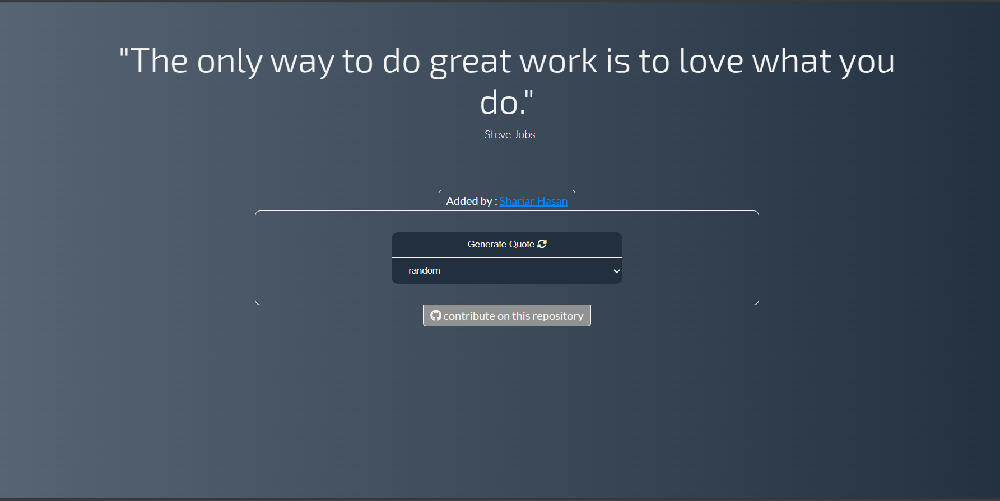

<div align="center">



</div>

# QuoteVerse


Quoteverse is a simple web application that generates random quotes to inspire, motivate, and enlighten. This open-source project aims to spread positivity though words.

## Table of Contents

- [Features](#features)
- [Preview](#preview)
- [Getting Started](#getting-started)
- [How to Contribute](#how-to-contribute)
  - [Add Quote](#add-quote)
- [License](#license)
- [Contributor List](#contributor-list)

## 🗒️Features

- **Random Quote Generation:** Click `Generate Quote` button and get a new quote every time.
- **Categories:** Choose from various categories such as Life, Motivation, Friendship, and more.
- **Author Information:** Each quote includes the name of the author who said it.
- **Contributor Information:** Each quote includes the name of the contributor who added the it.
- **Open for Contributions:** This project is open for contributions. Feel free to add new quotes and categories to enrich the collection.

### `Star` the repository, if you found it helpful/wonderfull.

## 🗒️Getting Started

To get started with Quoteverse, You can use QuoteVerse from [Live Site](https://shariar-hasan.github.io/QuoteVerse/) or follow these steps:

1. **Clone the Repository:**

   ```sh
   git clone https://github.com/Shariar-Hasan/QuoteVerse.git
   cd QuoteVerse
   ```

2. **Open `index.html` in Your Browser:**
   Simply open the `index.html` file in your preferred web browser to start using Quoteverse.

## 🧩How to Contribute

### Add Quote:

Contributions are welcome and encouraged! If you want to add Quote to the QuoteVerse, first of all `Star the repository` then follow these steps:

1. Fork the repository and clone it to your local machine.

   ```sh
   git clone https://github.com/<your-username>/QuoteVerse.git
   cd QuoteVerse
   ```

2. Open `Quote.js` and add a new Object in the array, for example :

```javascript
{
    quote: "your-quote-text",
    category: "quote-category",
    author: "author-of-the-quote",
    addedBy: "your-guthub-username"
}
```

2. Now save the file and make a commit.

   ```sh
   git commit -m "Added new feature: your feature description"
   ```

3. Push your changes to your forked repository.

   ```sh
   git push origin main
   ```

4. Open a pull request on the original repository.

#### follow all the steps to get your PR successfully merged

## 🔑License

This project is licensed under the [MIT License](LICENSE)

## 🛂Contributor List

Thanks to all the contributors:
<br/>
<a href = "https://github.com/Shariar-Hasan/QuoteVerse/graphs/contributors">

</a>
